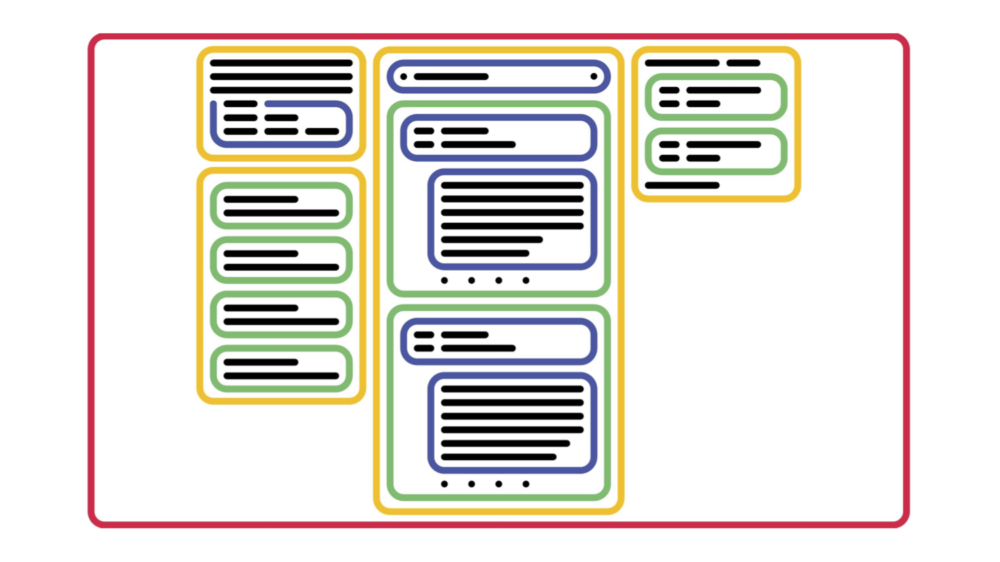

# Atomic Components

- https://qiita.com/kahirokunn/items/b599d2cf04d2580c412c

## Atoms
button, input, p  

## Molecules
search-form, like-button  

## Organisms
tweet-item, user-profile  

## Ecosystems
アプリケーションのドメインひとくくりを表現する  
timeline, trend, recommend-user  

## Environments
ページに相当する  

